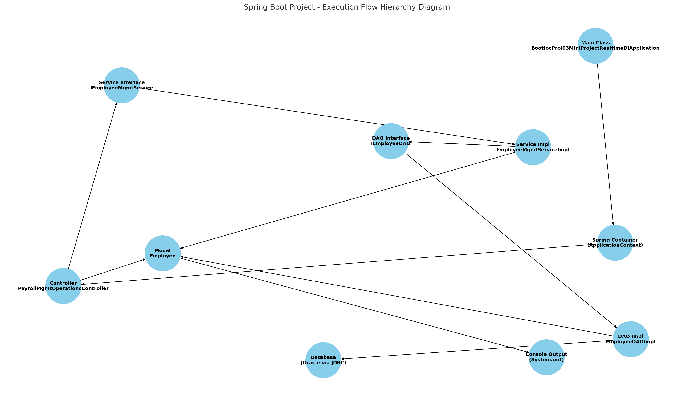

# BootIOCProj03-MiniProject-RealtimeDI

This is a mini real-time Spring Boot project that demonstrates **Dependency Injection (DI)** using layered architecture to retrieve employee details based on job designations from an Oracle database.

---

## 🔧 Technologies Used

- Java 17
- Spring Boot
- Spring Core (IOC)
- Spring JDBC (with HikariCP)
- Oracle Database
- Maven
- Eclipse IDE

---

## 📁 Project Structure

```

BootIOCProj03-MiniProject-RealtimeDI
│
├── src/main/java
│   └── com.nt
│       ├── BootIocProj03MiniProjectRealtimeDiApplication.java   // Main class
│       ├── controller
│       │   └── PayrollMgmtOperationsController.java              // Controller layer
│       ├── dao
│       │   ├── IEmployeeDAO.java
│       │   └── EmployeeDAOImpl.java                              // DAO Layer
│       ├── model
│       │   └── Employee.java                                     // POJO
│       └── service
│           ├── IEmployeeMgmtService.java
│           └── EmployeeMgmtServiceImpl.java                      // Service layer
│
├── src/main/resources
│   └── application.properties                                    // DB & App Config
│
├── pom.xml                                                       // Maven config
└── ...

````

---
## 📸 Sample Output

Here are the sample outputs after running the project:

### 1. Console Input and Output


### 2. Output When Employees Are Found


---

## 📊 Execution Flow Hierarchy Diagram



> 💡 Upload the image `execution-flow-diagram.png` to GitHub or keep it locally in the project directory.

---

## 🧠 Execution Flow (Step-by-Step)

1. **Application Starts**
   - The `BootIocProj03MiniProjectRealtimeDiApplication` class runs the Spring Boot app and starts the IOC container.

2. **User Input**
   - Program accepts 3 job designations from the user via the console.

3. **Controller Layer**
   - Calls the `PayrollMgmtOperationsController` method `showEmployeesByDesgs()`.

4. **Service Layer**
   - Calls the service `EmployeeMgmtServiceImpl`, which:
     - Converts inputs to uppercase.
     - Calls DAO to fetch employees.
     - Calculates `grossSalary` and `netSalary` for each employee.

5. **DAO Layer**
   - `EmployeeDAOImpl` performs database operations using JDBC.
   - Executes a SQL query with 3 designation inputs using `PreparedStatement`.

6. **Model Layer**
   - Fetched employee data is mapped into `Employee` objects.

7. **Result Display**
   - Controller returns the list and prints employee info with all details.

---
Great question, Lalit! You're asking **how the control flows from one class to another** — i.e., what mechanism causes one class to call another — especially in a **Spring Boot project with layered architecture**.

Here’s a **clear explanation of how the flow works from one class to another**, step-by-step — **with class names, method calls, and how they are connected** using **Spring’s Dependency Injection (DI)**.

---

## 🔁 How Flow Goes from One Class to Another in Your Project

---

### 🧱 1. `BootIocProj03MiniProjectRealtimeDiApplication.java`

**Starts the app and gets Controller bean from IOC container:**

```java
PayrollMgmtOperationsController controller = ctx.getBean("payroll-controller", PayrollMgmtOperationsController.class);
controller.showEmployeesByDesgs(desg1, desg2, desg3);
```

➡ Calls `showEmployeesByDesgs()` in **Controller**

---

### 🧱 2. `PayrollMgmtOperationsController.java`

**Autowired Dependency:**

```java
@Autowired
private IEmployeeMgmtService empService;
```

➡ Spring injects implementation: `EmployeeMgmtServiceImpl` into `empService`
➡ Calls `empService.fetchEmployeesByDesgs(desg1, desg2, desg3);`

---

### 🧱 3. `EmployeeMgmtServiceImpl.java`

**Autowired Dependency:**

```java
@Autowired
private IEmployeeDAO empDAO;
```

➡ Spring injects implementation: `EmployeeDAOImpl` into `empDAO`
➡ Calls `empDAO.showEmployeeByDesgs(...)`

---

### 🧱 4. `EmployeeDAOImpl.java`

**Autowired Dependency:**

```java
@Autowired
private DataSource ds;
```

➡ Spring injects connection pool (HikariCP)
➡ Gets DB connection → Prepares and executes SQL
➡ Maps data into `Employee` objects
➡ Returns `List<Employee>`

---

### 🧱 5. `Employee.java`

Just a POJO (Plain Old Java Object)

➡ Used to store employee data
➡ Set and get values using setters and getters
➡ Object printed using `toString()` in the Controller

---

## 🔁 Actual Flow in Code Form

```text
main()
  └─> controller.showEmployeesByDesgs()
        └─> empService.fetchEmployeesByDesgs()
              └─> empDAO.showEmployeeByDesgs()
                    └─> DB Access & Employee list
              └─> Set gross/net salary
        └─> Return List<Employee>
  └─> Print employee details
```

---
Step-by-Step Class & Method Call Flow
--------------------------------------

1️⃣ Application Start
---------------------
Class: BootIocProj03MiniProjectRealtimeDiApplication.java  
Method: public static void main(String[] args)

  ➜ SpringApplication.run(...) starts Spring Boot and creates IOC container
  ➜ Controller bean is fetched from context
  ➜ User enters 3 designations via Scanner
  ➜ Call to: controller.showEmployeesByDesgs(desg1, desg2, desg3)


2️⃣ Controller Layer
---------------------
Class: PayrollMgmtOperationsController.java  
Method: public List<Employee> showEmployeesByDesgs(String desg1, String desg2, String desg3)

  ➜ Delegates call to service method:
        empService.fetchEmployeesByDesgs(desg1, desg2, desg3)


3️⃣ Service Layer
---------------------
Class: EmployeeMgmtServiceImpl.java  
Method: public List<Employee> fetchEmployeesByDesgs(String desg1, String desg2, String desg3)

  ➜ Converts desg1, desg2, desg3 to UPPERCASE
  ➜ Calls DAO method:
        empDAO.showEmployeeByDesgs(desg1, desg2, desg3)
  ➜ Receives List<Employee> from DAO
  ➜ Applies business logic:
        grossSalary = salary + (salary * 0.4)
        netSalary = grossSalary - (grossSalary * 0.15)
  ➜ Returns modified List<Employee> to controller


4️⃣ DAO Layer
---------------------
Class: EmployeeDAOImpl.java  
Method: public List<Employee> showEmployeeByDesgs(String desg1, String desg2, String desg3)

  ➜ Gets JDBC Connection from DataSource (HikariCP)
  ➜ Prepares and executes SQL query:
        SELECT EMPNO, ENAME, JOB, SAL, DEPTNO FROM EMP WHERE JOB IN (?,?,?)
  ➜ Maps ResultSet data to Employee objects
  ➜ Returns List<Employee> to Service layer


5️⃣ Model Layer (POJO)
---------------------
Class: Employee.java

  ➜ Standard bean with:
        - empno, ename, job, salary, deptno
        - grossSalary, netSalary
  ➜ Used to store and display employee data


6️⃣ Back to Controller & Display
---------------------
Controller prints the final List<Employee> using forEach
  ➜ System.out.println(emp)

🎉 Final output is shown on the console
---
## 🚀 How to Run the Project

1. ✅ Make sure Oracle DB is running and the `EMP` table is available.
2. ✅ Update your Oracle DB credentials in `application.properties`.
3. ✅ Run the `BootIocProj03MiniProjectRealtimeDiApplication` class as a **Java Application**.
4. ✅ Enter designations (e.g., `CLERK`, `MANAGER`, `ANALYST`) when prompted.
5. ✅ Employee list will be displayed with gross and net salary.

---

## 📌 Features

* Layered architecture (Controller → Service → DAO)
* Uses Spring Dependency Injection
* JDBC with Oracle DB and HikariCP
* Runtime user input
* Business logic for salary calculation
---
